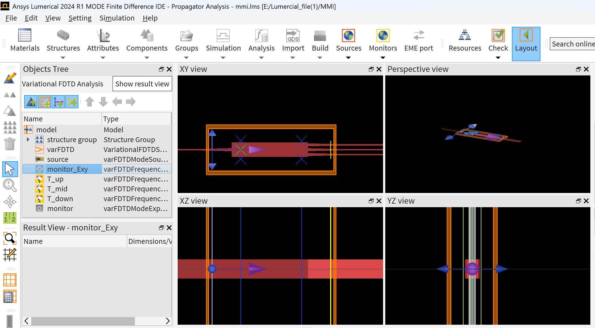
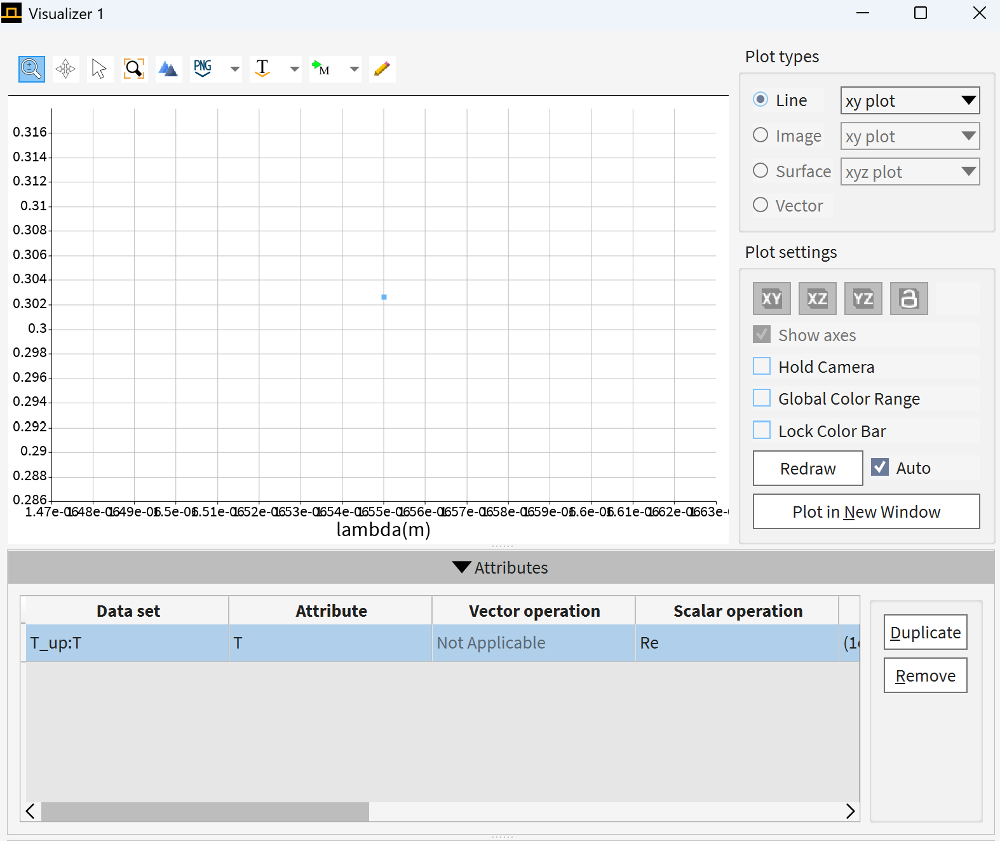
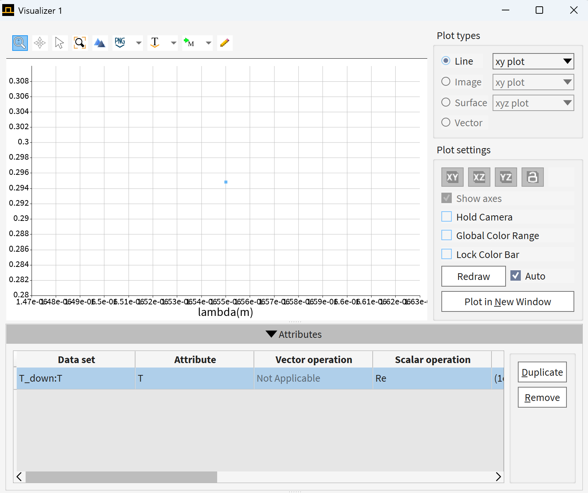
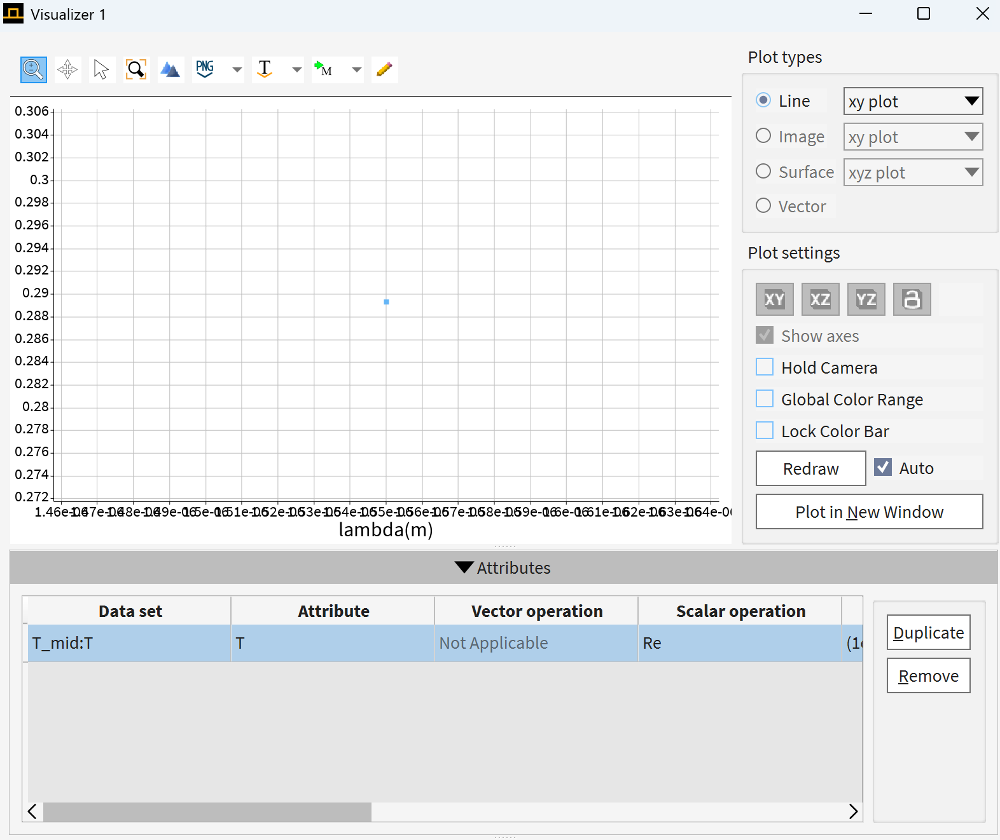
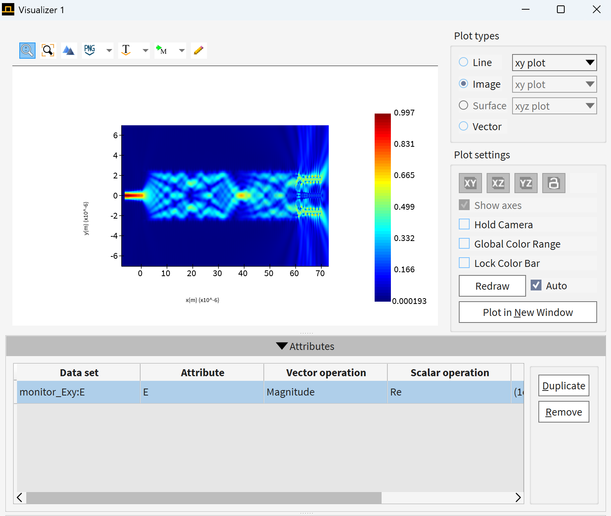

# MMI Waveguide Simulation using varFDTD

## 项目简介

本项目使用 Ansys Lumerical varFDTD 对多模干涉器件（Multimode Interference, MMI）波导进行仿真。  
通过改变 MMI 区域长度，分析不同输出端口的透射率变化和电场分布，从而研究 MMI 器件中的自成像效应。

---

## 项目目标

本项目的目标是研究 MMI 多模干涉波导中，**MMI 区域长度对输出端口功率分布的影响**。

通过对 `L_mmi` 进行参数扫描，观察不同长度下的透射率变化和电场分布，从而理解 MMI 器件中的自成像效应，并为后续 MMI 分束器设计提供参考。

---

## 我完成的工作

- 搭建 MMI 波导器件结构模型
- 设置 varFDTD 仿真区域、模式光源和输出监视器
- 对 MMI 区域长度进行参数扫描
- 提取上、中、下三个输出端口的透射率
- 绘制并分析电场分布图
- 根据仿真结果解释多模干涉和自成像现象

---

## 关键结果

| 项目 | 内容 |
|---|---|
| 仿真软件 | Ansys Lumerical |
| 求解器 | varFDTD |
| 器件类型 | MMI 多模干涉波导 |
| 扫描参数 | MMI 区域长度 |
| 扫描范围 | 10 μm – 60 μm |
| 分析内容 | 输出端口透射率、电场分布 |
| 主要现象 | 透射率随 MMI 长度呈周期性变化 |
---

## 📐 器件结构（Device Structure）

仿真模型包含以下关键组成部分：

- 单模输入波导（Input Waveguide）
- 多模干涉区域（MMI Region）
- 多端输出波导（Output Waveguides）
- 功率与场分布监视器（Monitors）

---

## ⚙️ 仿真配置（Simulation Setup）

- **求解器（Solver）**：varFDTD  
- **激励源（Source）**：模式光源（Mode Source）  
- **工作波长（Wavelength）**：1550 nm  

### 📡 监视器设置

- `T_up`：上输出端透射率  
- `T_mid`：中间输出端透射率  
- `T_down`：下输出端透射率  

---

## 📊 仿真结果（Results）

### 🔼 上端输出透射（T_up）

---

### 🔽 下端输出透射（T_down）

---

### ⚡ 中间区域透射（T_mid）

---

### 🌈 电场分布（Electric Field Distribution）

---

## 🔁 参数扫描（Parameter Sweep）

为优化器件性能，对 MMI 区长度进行参数扫描分析：

- **扫描参数**：Lmmi  
- **扫描范围**：10 μm – 60 μm  
- **采样点数**：199  
- **监测指标**：透射率（T）

---

## 🔍 结果分析（Analysis）

仿真结果表明：

- 透射率随 Lmmi 呈现明显的**周期性振荡特征**，反映出典型的多模干涉行为  
- 存在多个局部极值点，对应不同阶的**自成像位置（Self-imaging positions）**  
- 在约 **2.62 × 10⁻⁵ m** 处，透射率达到相对较高值（≈ 0.362）

👉 说明：

- MMI 器件具有明显的**长度敏感性**
- 合适的 Lmmi 可实现：
  - 最大透射（Max transmission）
  - 或均匀功率分束（Power splitting）

---

## 🧠 物理机制（Physical Mechanism）

MMI 器件的工作原理基于：

> **多模干涉（Multimode Interference）与自成像效应（Self-imaging）**

在 MMI 区内：

- 多个横向模式被激发并共同传播  
- 各模式之间产生**相位差累积（Phase accumulation）**  
- 在特定传播长度处形成**输入场的重构（Self-imaging）**  
- 从而决定输出端口的功率分布  

---

## 🚀 可扩展方向（Future Work）

- 优化结构实现 **1×2 / 1×3 分束器设计 /**
- 调整结构实现 **2×1 / 3×1 合束器设计 /**
- 结合 **优化算法（如 PSO / GA）** 自动搜索最优参数
- 扩展至 **宽带响应分析**
