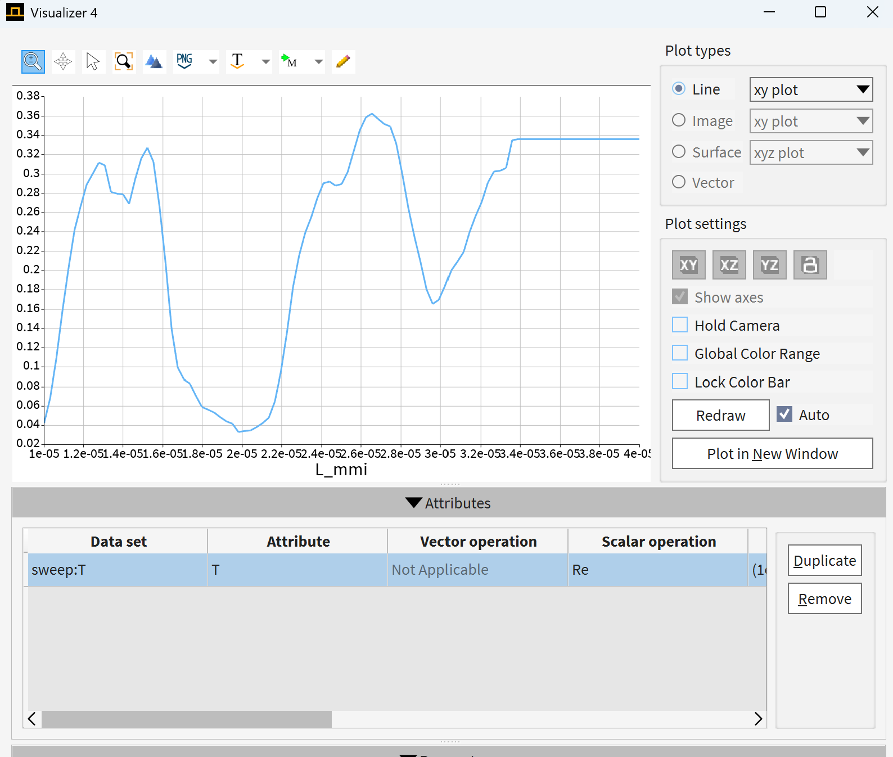

# 📡 MMI 多模干涉波导仿真（varFDTD）

本项目基于 **Lumerical FDTD Solutions** 中的 *varFDTD 求解器*，对 **多模干涉（MMI, Multimode Interference）波导结构**进行数值仿真，系统分析 **MMI 区长度（Lmmi）** 对输出端口透射特性及电磁场分布的影响规律。

---

## 📐 器件结构（Device Structure）

仿真模型包含以下关键组成部分：

- 单模输入波导（Input Waveguide）
- 多模干涉区域（MMI Region）
- 多端输出波导（Output Waveguides）
- 功率与场分布监视器（Monitors）

---

## ⚙️ 仿真配置（Simulation Setup）

- **求解器（Solver）**：varFDTD  
- **激励源（Source）**：模式光源（Mode Source）  
- **工作波长（Wavelength）**：1550 nm  

### 📡 监视器设置

- `T_up`：上输出端透射率  
- `T_mid`：中间输出端透射率  
- `T_down`：下输出端透射率  

---

## 📊 仿真结果（Results）

### 🔼 上端输出透射（T_up）

---

### 🔽 下端输出透射（T_down）

---

### ⚡ 中间区域透射（T_mid）

---

### 🌈 电场分布（Electric Field Distribution）

---

## 🔁 参数扫描（Parameter Sweep）

为优化器件性能，对 MMI 区长度进行参数扫描分析：

- **扫描参数**：Lmmi  
- **扫描范围**：10 μm – 60 μm  
- **采样点数**：99  
- **监测指标**：透射率（T）

---

## 🔍 结果分析（Analysis）

仿真结果表明：

- 透射率随 Lmmi 呈现明显的**周期性振荡特征**，反映出典型的多模干涉行为  
- 存在多个局部极值点，对应不同阶的**自成像位置（Self-imaging positions）**  
- 在约 **2.6 × 10⁻⁵ m** 处，透射率达到相对较高值（≈ 0.35）

👉 说明：

- MMI 器件具有明显的**长度敏感性**
- 合适的 Lmmi 可实现：
  - 最大透射（Max transmission）
  - 或均匀功率分束（Power splitting）

---

## 🧠 物理机制（Physical Mechanism）

MMI 器件的工作原理基于：

> **多模干涉（Multimode Interference）与自成像效应（Self-imaging）**

在 MMI 区内：

- 多个横向模式被激发并共同传播  
- 各模式之间产生**相位差累积（Phase accumulation）**  
- 在特定传播长度处形成**输入场的重构（Self-imaging）**  
- 从而决定输出端口的功率分布  

---

## 🚀 可扩展方向（Future Work）

- 优化结构实现 **1×2 / 1×3 均分器设计**
- 引入 **折射率调制** 提升器件性能
- 结合 **优化算法（如 PSO / GA）** 自动搜索最优参数
- 扩展至 **宽带响应分析**
