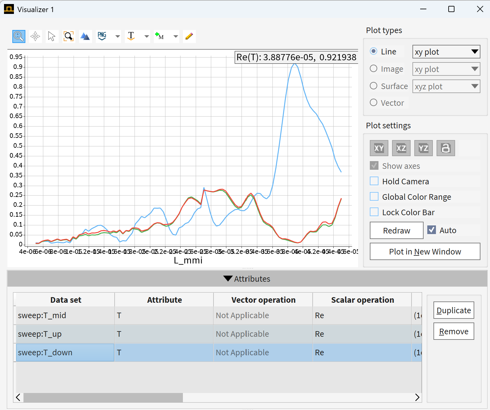
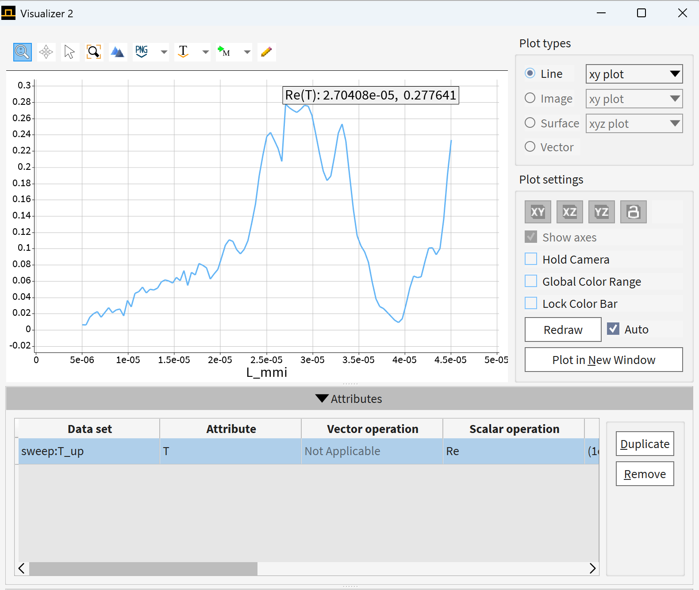
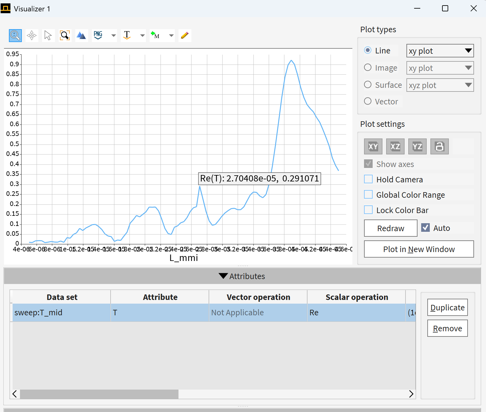
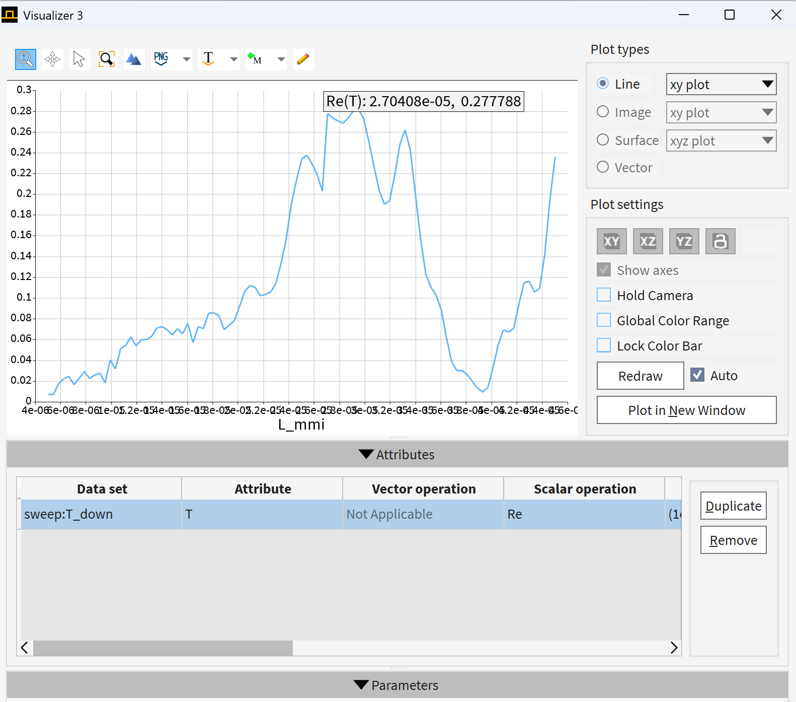

# MMI Waveguide Simulation using varFDTD

## 项目简介

本项目使用 Ansys Lumerical varFDTD 对多模干涉器件（Multimode Interference, MMI）波导进行仿真。  
通过改变 MMI 区域长度，分析不同输出端口的透射率变化和电场分布，从而研究 MMI 器件中的自成像效应。

---

## 项目目标

本项目的目标是研究 MMI 多模干涉波导中，**MMI 区域长度对输出端口功率分布的影响**。

通过对 `L_mmi` 进行参数扫描，观察不同长度下的透射率变化和电场分布，从而理解 MMI 器件中的自成像效应，并为后续 MMI 分束器设计提供参考。

---

## 关键结果

| 项目 | 内容 |
|---|---|
| 仿真软件 | Ansys Lumerical |
| 求解器 | varFDTD |
| 器件类型 | MMI 多模干涉波导 |
| 扫描参数 | MMI 区域长度 |
| 扫描范围 | 5 μm – 45 μm |
| 分析内容 | 输出端口透射率、电场分布 |
| 主要现象 | 透射率随 MMI 长度呈周期性变化 |
---

## 📐 器件结构（Device Structure）

仿真模型包含以下关键组成部分：

- 单模输入波导（Input Waveguide）
- 多模干涉区域（MMI Region）
- 多端输出波导（Output Waveguides）
- 功率与场分布监视器（Monitors）

---

## ⚙️ 仿真配置（Simulation Setup）

- **求解器（Solver）**：varFDTD  
- **激励源（Source）**：模式光源（Mode Source）  
- **工作波长（Wavelength）**：1550 nm  

### 📡 监视器设置

- `T_up`：上输出端透射率  
- `T_mid`：中间输出端透射率  
- `T_down`：下输出端透射率  

---

## 📊 仿真结果（Results）

### 🔼 上端输出透射（T_up）

---

### 🔽 下端输出透射（T_down）

---

### ⚡ 中间区域透射（T_mid）

---

### 🌈 电场分布（Electric Field Distribution）

---

## 🔁 参数扫描（Parameter Sweep）

为优化器件性能，对 MMI 区长度进行参数扫描分析：

- **扫描参数**：Lmmi  
- **扫描范围**：5 μm – 45 μm  
- **采样点数**：99 
- **监测指标**：透射率（T）

---

## 🔍 结果分析（Analysis）

参数扫描结果表明，三个输出端口的透射率随 MMI 区域长度 L_mmi 发生明显变化。这是由于光进入 MMI 宽波导区域后，会激发多个横向模式。不同模式具有不同的传播常数，因此在传播过程中会不断累积相位差，并在特定传播长度处形成不同的自成像分布。

由于器件结构在 y 方向具有上下对称性，T_up 和 T_down 的变化趋势基本一致，这与结构对称性相符合。

**1×3 均匀分束结果**
L_mmi ≈ 2.7 × 10^-5 m = 27 μm时，三个输出端口的透射率较为接近，可以实现较好的 **1×3 分束效果**。

T_up ≈ T_mid ≈ T_down ≈ 1/3

当前仿真结果表明，在 L_mmi ≈ 27 μm 附近，MMI 区域形成了较合适的自成像分布，使输入光场能够较均匀地耦合到三个输出波导中。因此，该长度可以作为 1×3 MMI 分束器设计的一个较优长度。

---

**中间端口高透射结果**
L_mmi = 3.89 × 10^-5 m = 38.9 μm时，中间输出端口透射率达到较高值。

| 输出端口      | 透射率   |
| --------- | ----- |
| `T_up`    | 0.013 |
| `T_mid`   | 0.920 |
| `T_down`  | 0.015 |
| `T_total` | 0.948 |

T_total = T_up + T_mid + T_down
T_total = 0.013 + 0.920 + 0.015 = 0.948

---

## 🧠 物理机制（Physical Mechanism）

MMI 器件的工作原理基于：

> **多模干涉（Multimode Interference）与自成像效应（Self-imaging）**

在 MMI 区内：

- 多个横向模式被激发并共同传播  
- 各模式之间产生**相位差累积（Phase accumulation）**  
- 在特定传播长度处形成**输入场的重构（Self-imaging）**  
- 从而决定输出端口的功率分布  

---

## 🚀 可扩展方向（Future Work）

- 优化结构实现 **1×2 / 1×3 分束器设计 /**
- 调整结构实现 **2×1 / 3×1 合束器设计 /**
- 结合 **优化算法（如 PSO / GA）** 自动搜索最优参数
- 扩展至 **宽带响应分析**

---

## 项目总结

本项目通过 varFDTD 仿真研究了 1×3 MMI 波导器件中 MMI 区域长度对输出功率分布的影响。

仿真结果表明，L_mmi 对 MMI 器件的输出特性具有显著影响。在当前结构参数下，L_mmi ≈ 27 μm 附近可以实现较好的 1×3 分束效果，而 L_mmi ≈ 38.9 μm 附近可以实现中间端口高透射输出。

该项目展示了光波导器件建模、Lumerical varFDTD 仿真、参数扫描、端口透射率分析以及多模干涉物理机制理解等能力。
